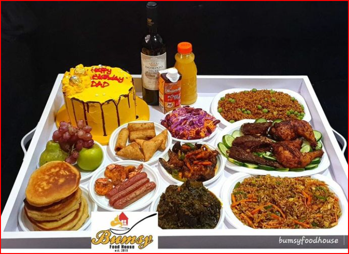

# LA-BELLA-BITES

## A very functional page showing showing the user about our page

This is a website showing our customer our menu list and how it`s made, <br>
Every part of this page shows the description on how the menu are also served and the prices

- Fresh ingredients
- Cozy Atmosphere
- Daily specials
- Margeherita pizza
- Truffle Mushroom Pasta
- Caprese Salad
- Wood-Fired Meatball Sub😉
- Tiramisu

## Tools in creating this project:

1.  **VS CODE**
2.  **CSS**
3.  **VERCEL** :for the live link

## Take a look at some preview


*picture 1: the front layout of the bella project*
## Our project:
```html
<header class="navbar">
  <h1>La Bella Bites</h1>
  <nav>
    <ul>
      <a href="http://Home">Home</a>
      <a href="http://Menu">Menu</a>
      <a href="http://Contact">Contact</a>
    </ul>
  </nav>
</header>
<section class="main">
  <div class="tp">
    <h2>Handmade Italian Flavours, Served With a Smile</h2>
    <p>
      Welcome to la Bella Bites- cozy vibes, fresh ingredients and recipes
      passed down through generations. <br />
      come taste our special wood-fired pizza and signature pastas
    </p>
    <a class="button" href="/file2.html"> see our menu</a>
    <br />
  </div>
  <div class="image">
    
  </div>
</section>

<section class="card">
  <div class="box-1">
    <h4>Fresh ingredients</h4>
    <p>Locally-sourced produce and house-made sauces everyday.</p>
  </div>
  <div class="box-2">
    <h4>Cozy Atmosphere</h4>
    <p>small dining room with warm light -perfect for friends & family</p>
  </div>
  <div class="box-3">
    <h4>Daily specials</h4>
    <p>Ask out staff about today`s chef special or the wine pairing</p>
  </div>
</section>
<h2>Contact & Reservations</h2>
<p>
  📧 Email: <a href="mailto:">hello@labellabites.example</a>
  <br />
  📱 phone: <a href="tel:+234">(555)123-4567</a>
</p>
<br />

<footer class="footer">
  <p>2025 La Bella Bites - made with 💝</p>
</footer>
```

# summary :smile:

This is how you can create a good html project.<br>
You can also find the link to this project here <br> 
:**githublink** <https://github.com/ADIAMO777/LA-BELLA-BITES.git> <br>
:**vercel** <https://vercel.com/adiamo-bankoles-projects> *live link*

## find a bug?

if you find an issue or would like to suggest an improvement on this project please submit an issue using the issue tab above.

## if you like this project

Mr Ife buy me a pizza 💝🍕
